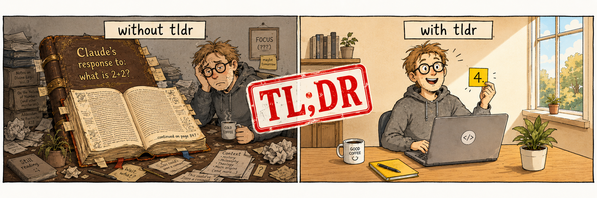

<p align="center">
  
</p>

# tldr

**A toggle for people tired of bible-sized AI responses.**

[](LICENSE)
[](.claude-plugin/plugin.json)
[](https://code.claude.com)
[](#requirements)
[](#use)

> **One slash command** · **~93 tokens per message when on, zero when off** · **No per-project setup** · **Persists across sessions**

You asked Claude what time it is. Three paragraphs later, you have a brief history of horology, an explainer on UTC offsets, and a caveat about leap seconds. You wanted "3:47pm".

`tldr` is a tiny Claude Code plugin that adds one slash command: `/tldr:tldr`. Flip it on and Claude defaults to 1-3 sentence replies for every subsequent message. Ask for "detail" or "explain" and you get the full essay anyway — your call, every turn.

## Why install

- You ask short questions and want short answers
- You're reviewing diffs or debugging — every "let me first explain my approach…" preamble costs you 20 seconds
- You want a context-friendly default, with a one-word override when you actually do need the long version
- You don't want to retype "be brief" at the top of every message
- You'd rather burn 93 tokens reminding Claude to be terse than 900 reading the answer

## Install

```
/plugin marketplace add https://github.com/marcelopaniza/tldr
/plugin install tldr@tldr
```

## Use

```
/tldr:tldr           # toggle (default)
/tldr:tldr on
/tldr:tldr off
/tldr:tldr status
```

State lives at `~/.claude/plugins/data/tldr/state` and persists across sessions and projects. Toggle once, applies everywhere until you flip it off.

## What it costs

| State | Per user message | Why |
|---|---|---|
| Off | **0 tokens** | Hook exits silently before Claude sees anything |
| On  | **~93 tokens** | Hook prepends a short instruction telling Claude to be terse, with an exception clause for when you ask for detail |

No persistent context, no system-prompt rewriting, no daemon — just a `UserPromptSubmit` hook that reads a one-byte state file.

## The escape hatch

If your message contains any of these phrases, `tldr` yields and Claude gives you the full answer for that turn:

- "explain"
- "in detail"
- "in full"
- "walk me through"
- "deep dive"
- "step by step"

So `tldr` is on most of the time, and you opt back into the bible when you actually need it.

## Requirements

- Claude Code with plugin support
- `bash` (any reasonably modern version)
- That's it.

## Local development

Test without installing:

```
claude --plugin-dir /path/to/this/repo
```
